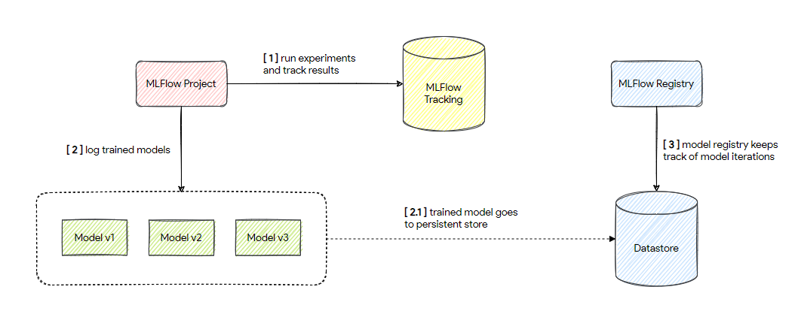

# Digital HR Program - End-to-end Machine Learning

## The Machine Learning Workflow

Machine learning requires experimenting with a wide range of datasets, data preparation steps, and algorithms to build a model that maximizes some target metric. Once you have built a model, you also need to deploy it to a production system, monitor its performance, and continuously retrain it on new data and compare with alternative models.

Being productive with machine learning can therefore be challenging for several reasons:

- It’s difficult to keep track of experiments.
- It’s difficult to reproduce code.
- There’s no standard way to package and deploy models.
- There’s no central store to manage models.

### MLflow Components

MLflow provides four components to help manage the ML workflow:

- **Tracking** is an API and UI for logging parameters, code versions, metrics, and artifacts when running your machine learning code and for later visualizing the results.
- **Projects** are a standard format for packaging reusable data science code.
- **Models** offer a convention for packaging machine learning models in multiple flavors, and a variety of tools to help you deploy them.
- **Registry** offers a centralized model store, set of APIs, and UI, to collaboratively manage the full lifecycle of an MLflow Model.

